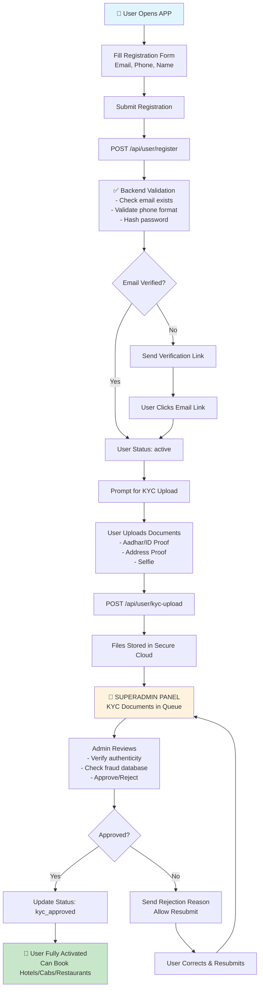
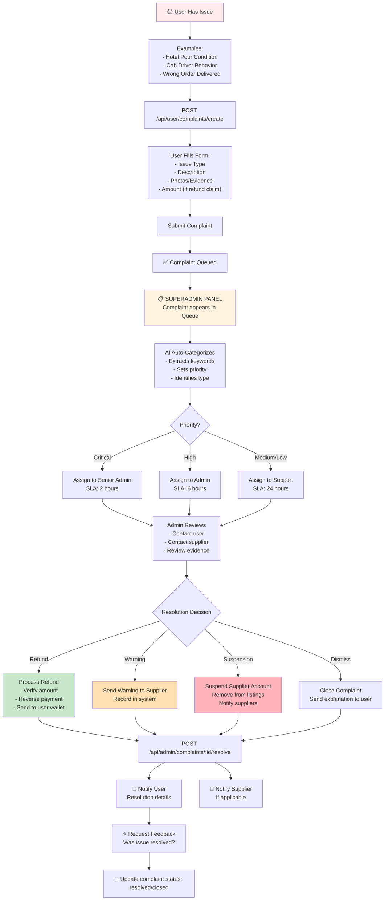
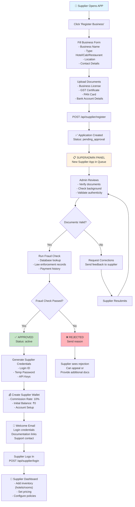
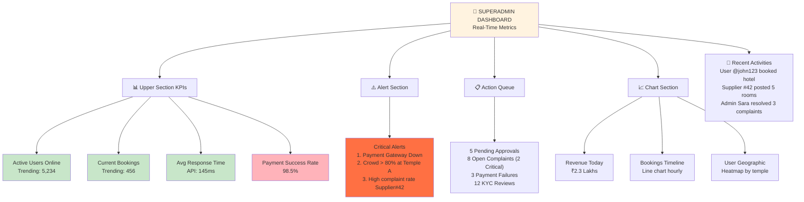
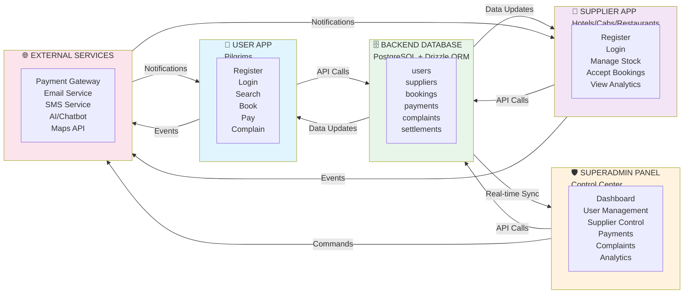
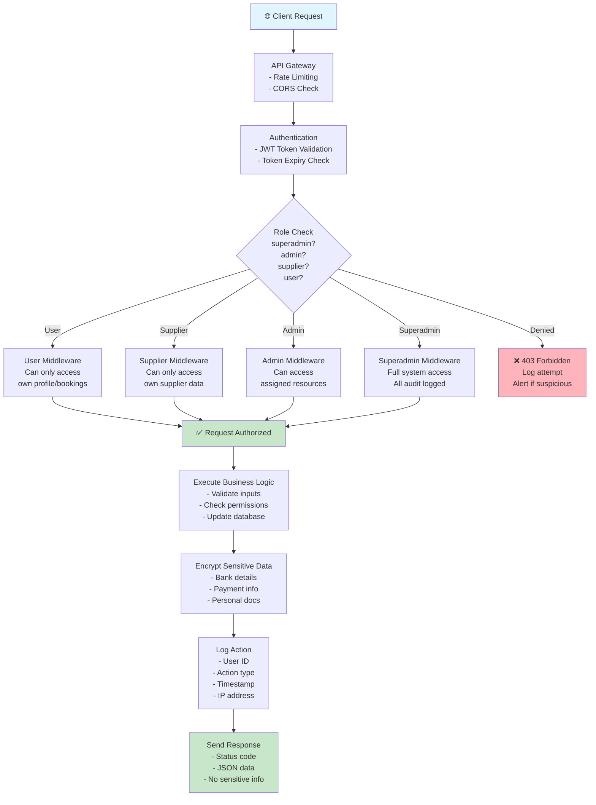

# 🏗️ USER APP FLOWS & SUPERADMIN INTEGRATION DIAGRAMS

## 1️⃣ COMPLETE USER REGISTRATION FLOW (Pilgrim)



---

## 2️⃣ HOTEL BOOKING FLOW (User → Superadmin)

```mermaid
graph TD
    A["🏨 User Searches Hotels"] --> B["Filter by<br/>- Date Range<br/>- Budget<br/>- Location<br/>- Rating"]
    
    B --> C["GET /api/user/hotels/search"]
    C --> D["BACKEND returns<br/>matching listings"]
    
    D --> E["User Selects Hotel"]
    E --> F["View Details<br/>- Photos<br/>- Reviews<br/>- Price<br/>- Availability"]
    
    F --> G["Click 'Book Now'"]
    G --> H["POST /api/user/bookings/create<br/>{hotel_id, dates, rooms, guests}"]
    
    H --> I["✅ Backend Processing<br/>- Create booking_id<br/>- Reserve rooms<br/>- Calculate total amount<br/>- Set status: pending"]
    
    I --> J["Generate Payment Link<br/>Amount: ₹5,000<br/>Commission(10%): ₹500<br/>Net to Hotel: ₹4,500"]
    
    J --> K["👤 User Pays<br/>Card/UPI/Wallet"]
    K --> L["POST /api/user/payments/confirm"]
    
    L --> M["✅ Payment Verified<br/>from Payment Gateway"]
    M --> N["Update Booking<br/>Status: confirmed"]
    
    N --> O["💰 SUPERADMIN SEES<br/>- Transaction in Dashboard<br/>- Commission calculated<br/>- Supplier payout scheduled"]
    
    O --> P["📧 Hotel Owner Notified<br/>New Booking Received<br/>Booking Details Sent"]
    
    P --> Q["📧 User Confirmation<br/>Booking ID, Receipt, Hotel Details"]
    
    Q --> R["💾 Record in Database<br/>- bookings table<br/>- payments table<br/>- settlements table (pending)"]
    
    style A fill:#e1f5ff
    style O fill:#fff3e0
    style R fill:#c8e6c9
```



---

## 3️⃣ COMPLAINT & DISPUTE RESOLUTION FLOW



---

## 4️⃣ SUPPLIER ONBOARDING FLOW (Hotel/Cab/Restaurant Owner)



---

## 5️⃣ PAYMENT & SETTLEMENT CYCLE (Superadmin View)

```mermaid
graph TD
    A["💳 Payment Received from User"] --> B["₹5,000<br/>Hotel Commission Rate: 10%"]
    B --> C["Calculate Split:<br/>Platform Commission: ₹500<br/>Net to Hotel: ₹4,500<br/>Tax: ₹50"]
    
    C --> D["Record Transaction<br/>- payments table<br/>- bookings table linked<br/>- settlements table (pending)"]
    
    D --> E["📊 SUPERADMIN DASHBOARD<br/>Aggregates Daily Settlements"]
    E --> F["Auto-Settlement Process<br/>Run Daily (2 PM)<br/>OR Manual Trigger"]
    
    F --> G["Prepare Settlement Report<br/>- Total Bookings: 150<br/>- Total Revenue: ₹75,000<br/>- Commissions: ₹7,500<br/>- Net Payable: ₹67,500"]
    
    G --> H{"Settlement Approved?"}
    H -->|Auto| I["Status: approved"]
    H -->|Manual| J["Admin Reviews<br/>Check for<br/>- Disputes<br/>- Refunds<br/>- Chargebacks"]
    
    J --> K["Approve/Reject"]
    K --> I
    
    I --> L["Process Payment<br/>- Initiate Bank Transfer<br/>- Record Transaction ID<br/>- Mark as processed"]
    
    L --> M["📧 Settlement Email<br/>Settlement Details<br/>Bank Reference<br/>Invoice Attached"]
    
    M --> N["Update Settlement Status<br/>status: processed"]
    N --> O["💰 Supplier Receives Payment<br/>(T+1 days)"]
    
    O --> P["💾 Record in<br/>- settlements table<br/>- supplier wallet<br/>- audit logs"]
    
    style A fill:#e1f5ff
    style E fill:#fff3e0
    style O fill:#c8e6c9
```



---

## 6️⃣ EMERGENCY ALERT BROADCAST FLOW

```mermaid
graph TD
    A["⚠️ Critical Event Reported"] --> B["Examples:<br/>- Crowd Surge<br/>- Weather Alert<br/>- Safety Issue<br/>- Service Outage"]
    
    B --> C["📞 Superadmin Notified<br/>by local authorities/<br/>users/suppliers"]
    
    C --> D["Superadmin Opens Panel<br/>Click 'Create Emergency Alert'"]
    
    D --> E["Fill Alert Form:<br/>- Type: Crowd/Weather/Safety<br/>- Location: Temple X<br/>- Radius: 2 km<br/>- Severity: Critical<br/>- Message: 'Avoid area'<br/>- Duration: 4 hours"]
    
    E --> F["POST /api/admin/emergency-alerts"]
    
    F --> G["✅ Backend Processing<br/>- Validate location<br/>- Identify affected users<br/>- Queue notifications"]
    
    G --> H["🎯 Target Users<br/>by location (lat/lng)<br/>within 2km radius"]
    
    H --> I["📱 Push Notifications<br/>Sent to User Apps<br/>🚨 HIGH PRIORITY"]
    
    I --> J["👥 Users See Alert<br/>- Red banner at top<br/>- Auto-suggests<br/>  alternatives<br/>- Shows safe routes"]
    
    J --> K["💬 Support Team Alerted<br/>Prepare for calls<br/>Activate help desk<br/>Brief staff on issue"]
    
    K --> L["🚕 Supplier Apps Also Notified<br/>Cab drivers reroute<br/>Hotels prepare<br/>Restaurants increase staff"]
    
    L --> M["📊 SUPERADMIN TRACKS<br/>- Ack Count (100/150)<br/>- Cancellations (25)<br/>- Reroutes (40)<br/>- New bookings nearby<br/>- Help desk calls (15)"]
    
    M --> N["Admin Closes Alert<br/>when situation improves<br/>POST /api/admin/alerts/:id/close"]
    
    N --> O["Post-Analysis<br/>- Generate report<br/>- Identify learnings<br/>- Update procedures<br/>- Archive for future"]
    
    style A fill:#ffebee
    style G fill:#fff3e0
    style J fill:#ffebee
    style K fill:#fff3e0
```



---

## 7️⃣ SUPERADMIN REAL-TIME MONITORING



---

## 📊 DATA FLOW BETWEEN TIERS



---

## 🔐 SECURITY ARCHITECTURE



---

## 📱 UI LAYOUT SKETCHES

### **User App - Home Screen**
```
┌─────────────────────────────────────┐
│  🔔 Kumbh360     Profile    ⚙️      │
├─────────────────────────────────────┤
│                                      │
│  🚨 EMERGENCY ALERT (if any)        │
│  Crowd surge at Temple X - Avoid     │
│                                      │
│  🎯 Quick Access                     │
│  ┌──────────────┬──────────────┐    │
│  │ 🏨 Hotels    │ 🍕 Food      │    │
│  └──────────────┴──────────────┘    │
│  ┌──────────────┬──────────────┐    │
│  │ 🚕 Cabs      │ 💬 Chatbot   │    │
│  └──────────────┴──────────────┘    │
│                                      │
│  📍 Trending Near You                │
│  [Hotel A] ⭐⭐⭐⭐⭐ 250 bookings  │
│  [Hotel B] ⭐⭐⭐⭐ 180 bookings    │
│                                      │
│  [My Bookings] [History] [Help]     │
└─────────────────────────────────────┘
```

### **Superadmin Dashboard - Main View**
```
┌─────────────────────────────────────────────────┐
│ 🛡️ SUPERADMIN DASHBOARD      [ⓘ] [Settings] [👤] │
├─────────────────────────────────────────────────┤
│                                                   │
│ KPI CARDS:                                      │
│ ┌─────────────┬─────────────┬─────────────┐    │
│ │ 📊 Users    │ 💰 Revenue  │ 📦 Bookings │    │
│ │ 45,230      │ ₹1.2 Cr     │ 12,340      │    │
│ └─────────────┴─────────────┴─────────────┘    │
│                                                   │
│ ⚠️ CRITICAL ALERTS (3)                          │
│ • Payment Gateway Timeout  [View][Retry]        │
│ • Supplier #42 Complaints ↑ [Review][Action]    │
│ • 5 KYC Docs Pending  [Review]                  │
│                                                   │
│ CHARTS:                                         │
│ ┌────────────────────────────────────────────┐  │
│ │ Revenue Trend (Last 30 Days)                │  │
│ │ Line chart graph                            │  │
│ └────────────────────────────────────────────┘  │
│                                                   │
│ QUICK ACTIONS:                                  │
│ [📋 Users] [🏢 Suppliers] [💳 Settlements]     │
│ [⚠️ Complaints] [🚨 Emergency] [📊 Analytics]  │
└─────────────────────────────────────────────────┘
```

---

## 🎯 NEXT STEPS

1. **Review this document** - Understand all flows
2. **Confirm requirements** - Any custom needs?
3. **Database design** - Create schema files
4. **API structure** - Create route files
5. **Frontend components** - Build UI for each tier
6. **Integration** - Connect all pieces
7. **Testing** - Unit & integration tests
8. **Deployment** - CI/CD setup

Ready to proceed? Which should we build first:
- ✅ Database schema (tables & relationships)
- ✅ Authentication & JWT system
- ✅ Admin routes & controllers
- ✅ Frontend components for superadmin panel
